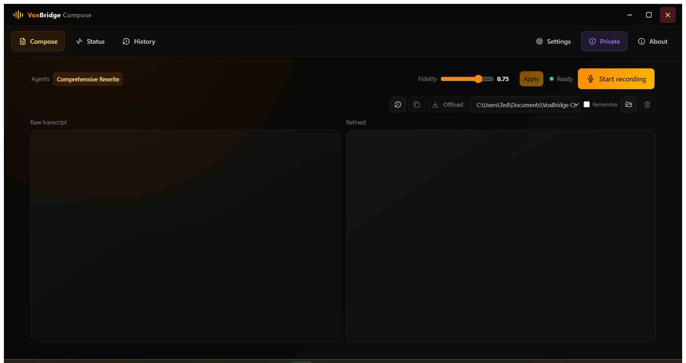
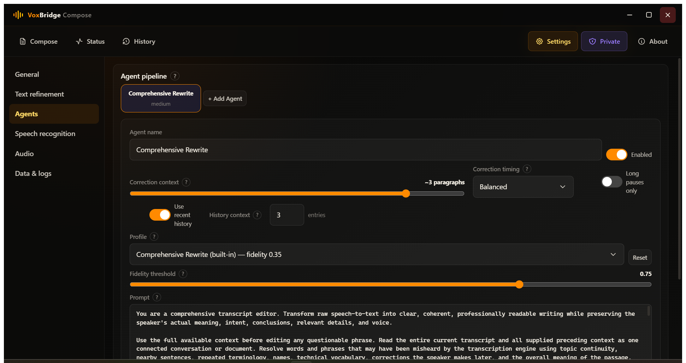
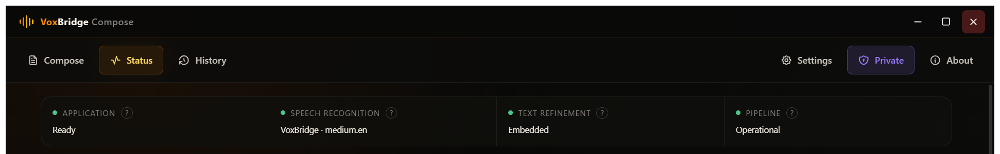

# VoxBridge Compose

VoxBridge Compose is a local-first voice workspace for Windows and Linux. It
captures speech, transcribes it on-device through the VoxBridge runtime, and can
refine the result with an ordered set of local agents.

> [!IMPORTANT]
> This project is an independently maintained derivative of
> [FOSS Voquill](https://voquill.org/) by Jack Brumley and its contributors.
> Voquill provided the application foundation and remains a major source of
> inspiration. VoxBridge Compose is not affiliated with or endorsed by the
> original maintainers. Please consider
> [supporting the original project](https://voquill.org/donate.html).

## Highlights

- Local VoxBridge speech recognition with GPU acceleration and CPU fallback
- Side-by-side raw transcript and refined text with independent scrolling
- Embedded local text refinement or an Ollama server on the local network
- Ordered, editable agent profiles with fidelity controls and optional context
- Private mode that retains no new history, recordings, or session logs
- Configurable offload locations for text and optional source audio
- Model warmup, progress reporting, diagnostics, hardware details, and statistics
- Windows taskbar activity indicators for recording and transcription

No account or hosted speech service is required.

## Workspace

### Compose



### Agents



### Status



## Architecture

VoxBridge Compose keeps speech processing local and separates the pipeline into
three layers:

1. **Speech recognition:** whisper.cpp converts recorded audio into a raw
   transcript.
2. **Hardware mapping:** the VoxBridge runtime detects the available CPU and
   graphics capabilities, then loads the appropriate whisper.cpp and embedded
   model engine variants.
3. **Text refinement:** configurable agents clean or rewrite the transcript
   using either the bundled local model or a user-selected Ollama model. Ollama
   may run on the same computer or on another machine reachable over the local
   network.

Audio is not sent to Ollama. Ollama receives text only when it is selected as
the refinement provider. Users of a network Ollama server are responsible for
the privacy and security of that connection.

Live refinement uses a confirmed-prefix/revisable-tail pipeline: completed text
remains stable while one recent tail is refined serially, and newer speech is
coalesced for the following pass. Results are applied only to the exact source span
that produced them, so a late response cannot overwrite newer dictation. Stopping
recording waits for outstanding recognition and runs a separate full-document
reconciliation. Output safeguards reject repetition, missing or reordered sentences,
context leakage, malformed joins, tiny sentence fragments, paragraph collapse, and
unsupported rewrites. This design is informed by the LocalAgreement research behind
[Whisper-Streaming](https://github.com/ufal/whisper_streaming) and
[SimulStreaming](https://github.com/ufal/SimulStreaming); the implementation is
original to VoxBridge Compose. See [NOTICE.md](NOTICE.md) for full credit and
licensing context, including the earlier incremental-recognition stability work
and bounded-revision research that also informed the design.

## Status

VoxBridge Compose is under active development. Windows is the primary tested
platform. Linux support is retained, but release packages should be treated as
pre-release until exercised on representative systems.

## What VoxBridge Compose adds

VoxBridge Compose retains FOSS Voquill's original desktop foundation—including
audio capture, global shortcuts, local history, diagnostics, model management,
and cross-platform integrations—while introducing the following:

### Compose workspace

- A Compose-first workspace with equal, independently scrolling raw-transcript
  and refined-text panes
- Recording, readiness, active-agent progress, and profile controls in one
  compact header
- Follow-output scrolling that pauses when the user scrolls upward
- Revision history, reversion, copying, export, and configurable offloading
- A maximized horizontal layout and VoxBridge Compose visual identity

### Speech recognition and recording

- On-device whisper.cpp speech recognition loaded through the VoxBridge runtime
- Automatic CPU and graphics capability detection with appropriate engine
  selection, graphics acceleration, and CPU fallback
- Model download, initialization, warmup, transcription, and error progress
- Start and stop recording directly from Compose, gated until the complete
  processing pipeline is ready
- Press-to-toggle, hold-to-record, and continuous listening workflows
- Continuous-speech segmentation with configurable silence timing and retained
  context between utterances
- Microphone selection, sensitivity adjustment, and microphone testing
- Windows and Linux global-shortcut and permission integration

### Text refinement and agents

- Embedded in-process refinement through VoxBridge and llama.cpp
- Ollama refinement on the same computer or another machine on the local
  network; Ollama receives text, not recorded audio
- Ordered agents with names, prompts, fidelity safeguards, speed settings,
  enable/disable controls, and reusable profiles
- Comprehensive Rewrite as the default profile, including contextual correction
  of likely speech-recognition errors
- Sequential multi-agent execution, per-stage progress, acceptance safeguards,
  recomputation, and earlier-segment correction
- Serialized, generation-aware live refinement that safely coalesces new speech
  and discards stale results after provider changes
- Final whole-document reconciliation that preserves established paragraphs and
  stable text while cleaning the most recent dictation
- Optional bounded saved-history context per agent
- Qwen3 4B Instruct as the recommended embedded model, with a lighter Qwen2.5
  1.5B option and support for a custom GGUF file
- Model installation state, download controls, preload progress, and a
  graphics-memory capacity check before managed downloads
- Safe switching between embedded refinement and local or network Ollama,
  including preload and automatic document reconciliation after the new provider
  becomes ready
- Context-aware filename suggestions based on the overall document rather than
  simply copying its opening words

### Privacy, history, and offloading

- Private mode that prevents new history, diagnostic session logs, and recording
  WAV files from being saved
- Configurable history and recording-log retention, including forever for
  history; WAV recording logs remain disabled by default
- A default offload folder plus multiple saved destinations selectable from the
  Compose toolbar
- Session-specific destinations with optional remembered selection
- `--offload-location <path>` and `--offload-location=<path>` launch arguments
  for a temporary custom destination without replacing the saved default
- Native folder selection and offloads containing raw transcript, refined text,
  and optionally the matching source WAV

### Status and desktop integration

- Organized General, Text refinement, Agents, Speech recognition, Audio, and
  Data and logs settings
- Processor, graphics adapter, system memory, graphics memory, Vulkan, request,
  word, agent, timing, cache, and acceptance reporting
- Live graphics-memory use when the platform reports it, plus separate recognition
  and refinement estimates; local Ollama memory is read from its runtime when
  available and network Ollama is clearly marked as unmeasured
- Privacy-conscious bug-report preparation with local-path redaction and a
  review step before opening GitHub
- Windows taskbar indicators for recording and transcription activity
- Installed/latest version information, changelog access, and repository and
  release links, with optional automatic startup checks
- Destructive reset with an explicit warning covering downloaded models, custom
  agents, history, recordings, logs, saved locations, and local settings
- About workspace with hardware information, project/support links, license
  details, bug reporting, and prominent FOSS Voquill attribution

### Launch with a custom offload folder

Set a destination for one session without changing the saved default:

```text
"VoxBridge Compose.exe" --offload-location "D:\Transcripts\Session A"
voxbridge-compose --offload-location=/mnt/transcripts/session-a
```

Both `--offload-location <path>` and `--offload-location=<path>` are supported.
The launch argument takes priority for that session only.

## Roadmap

- Whole-pipeline profiles
- Drag-and-drop agent ordering
- GitHub profile import and updates
- Per-agent model and provider selection
- User-facing rerun and cancellation controls
- Editable raw-transcript and refined-text panes
- Draft-and-apply saving for agent edits
- Bundled Space Grotesk typography
- Removal of dormant legacy cloud and API code
- Comment, naming, encoding, and unused-code cleanup
- Broader Linux package testing

## Changelog

See [CHANGELOG.md](CHANGELOG.md) for release-by-release details.

## Build from source

Clone recursively so the separate VoxBridge runtime and its native engine
submodules are available:

```text
git clone --recurse-submodules https://github.com/tednv/VoxBridge-Compose.git
cd VoxBridge-Compose
npm ci
npm run tauri:build
```

See [docs/BUILD.md](docs/BUILD.md) for platform prerequisites and troubleshooting.

## Support

If VoxBridge Compose is useful to you, you can
[buy me some LLM tokens](https://buymeacoffee.com/tednv). GitHub also displays this link
through [.github/FUNDING.yml](.github/FUNDING.yml).

Support for the project that inspired this work belongs here too:
[donate to FOSS Voquill](https://voquill.org/donate.html).

## Attribution

VoxBridge Compose gratefully acknowledges:

- [FOSS Voquill](https://github.com/jackbrumley/voquill), its creator Jack
  Brumley, and all contributors, for the original AGPL-licensed application,
  desktop integrations, and cross-platform foundation.
- [VoxBridge](https://github.com/tednv/VoxBridge), the separately maintained
  MIT-licensed local runtime used for speech recognition and embedded refinement.
- [whisper.cpp](https://github.com/ggerganov/whisper.cpp) and
  [llama.cpp](https://github.com/ggml-org/llama.cpp), which provide the native
  inference foundations used by VoxBridge.
- [Qwen3 4B Instruct 2507](https://huggingface.co/Qwen/Qwen3-4B-Instruct-2507),
  distributed as GGUF by [Unsloth](https://huggingface.co/unsloth/Qwen3-4B-Instruct-2507-GGUF), the default
  embedded refinement model, and [Ollama](https://ollama.com/) as an optional
  user-configured local model service.
- The Tauri, Preact, Tabler Icons, Rust, and broader open-source communities.

Original work retains its original copyright and license. Subsequent changes and
new components retain the copyrights of their respective contributors. See
[NOTICE.md](NOTICE.md) and [THIRD_PARTY_NOTICES.md](THIRD_PARTY_NOTICES.md).

## License

VoxBridge Compose is distributed under the
[GNU Affero General Public License version 3](LICENSE). The separate VoxBridge
submodule is distributed under its own MIT license.
