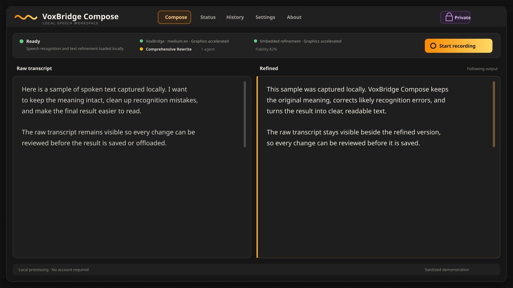

# VoxBridge Compose

VoxBridge Compose is a local-first voice workspace for Windows and Linux. It
captures speech, transcribes it on-device through the VoxBridge runtime, and can
refine the result with an ordered set of local agents.

> [!IMPORTANT]
> This project is an independently maintained derivative of
> [FOSS Voquill](https://voquill.org/) by Jack Brumley and its contributors.
> Voquill provided the application foundation and remains a major source of
> inspiration. VoxBridge Compose is not affiliated with or endorsed by the
> original maintainers. Please consider
> [supporting the original project](https://voquill.org/donate.html).

## Highlights

- Local VoxBridge speech recognition with GPU acceleration and CPU fallback
- Side-by-side raw transcript and refined text with independent scrolling
- Embedded local text refinement or an Ollama server on the local network
- Ordered, editable agent profiles with fidelity controls and optional context
- Private mode that retains no new history, recordings, or session logs
- Configurable offload locations for text and optional source audio
- Model warmup, progress reporting, diagnostics, hardware details, and statistics
- Windows taskbar activity indicators for recording and transcription

No account or hosted speech service is required.

## Workspace



## Architecture

VoxBridge Compose keeps speech processing local and separates the pipeline into
three layers:

1. **Speech recognition:** whisper.cpp converts recorded audio into a raw
   transcript.
2. **Hardware mapping:** the VoxBridge runtime detects the available CPU and
   graphics capabilities, then loads the appropriate whisper.cpp and embedded
   model engine variants.
3. **Text refinement:** configurable agents clean or rewrite the transcript
   using either the bundled local model or a user-selected Ollama model. Ollama
   may run on the same computer or on another machine reachable over the local
   network.

Audio is not sent to Ollama. Ollama receives text only when it is selected as
the refinement provider. Users of a network Ollama server are responsible for
the privacy and security of that connection.

## Status

VoxBridge Compose is preparing for its first independent release. Windows is the
primary tested platform. Linux support is retained, but release packages should be
treated as pre-release until exercised on representative systems.

## Build from source

Clone recursively so the separate VoxBridge runtime and its native engine
submodules are available:

```text
git clone --recurse-submodules https://github.com/tednv/VoxBridge-Compose.git
cd VoxBridge-Compose
npm ci
npm run tauri:build
```

See [docs/BUILD.md](docs/BUILD.md) for platform prerequisites and troubleshooting.

## Support

If VoxBridge Compose is useful to you, you can
[buy me some LLM tokens](https://buymeacoffee.com/tednv). GitHub also displays this link
through [.github/FUNDING.yml](.github/FUNDING.yml).

Support for the project that inspired this work belongs here too:
[donate to FOSS Voquill](https://voquill.org/donate.html).

## Attribution

VoxBridge Compose gratefully acknowledges:

- [FOSS Voquill](https://github.com/jackbrumley/voquill), its creator Jack
  Brumley, and all contributors, for the original AGPL-licensed application,
  desktop integrations, and cross-platform foundation.
- [VoxBridge](https://github.com/tednv/VoxBridge), the separately maintained
  MIT-licensed local runtime used for speech recognition and embedded refinement.
- [whisper.cpp](https://github.com/ggerganov/whisper.cpp) and
  [llama.cpp](https://github.com/ggml-org/llama.cpp), which provide the native
  inference foundations used by VoxBridge.
- [Qwen2.5](https://huggingface.co/Qwen/Qwen2.5-0.5B-Instruct-GGUF), the default
  embedded refinement model, and [Ollama](https://ollama.com/) as an optional
  user-configured local model service.
- The Tauri, Preact, Tabler Icons, Rust, and broader open-source communities.

Original work retains its original copyright and license. Subsequent changes and
new components retain the copyrights of their respective contributors. See
[NOTICE.md](NOTICE.md) and [THIRD_PARTY_NOTICES.md](THIRD_PARTY_NOTICES.md).

## License

VoxBridge Compose is distributed under the
[GNU Affero General Public License version 3](LICENSE). The separate VoxBridge
submodule is distributed under its own MIT license.
